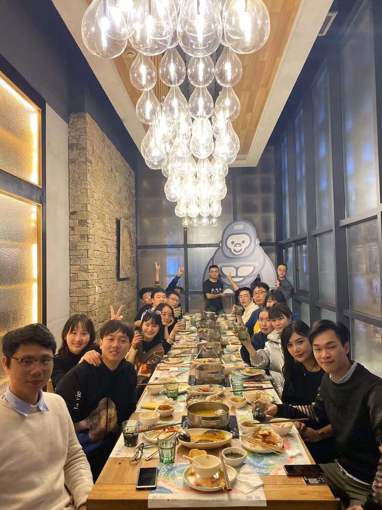

I read a lot of fabulous developers’ tweets on the review of the end of the year. And I was inspired to write my own one.

## Short List of Achievements of 2019
- 💼 joined a company which meets my thoughts
* 📖 learned more knowledge/skills about my career
- 💪 keeping going to gym since May.
- 🧍‍♂️ started to stand while working. 
- 📒 started to keep a personal blog which I am writing.

Last year’s resolution was simple. And I could say that probably it was achieved, for I certainly did one thing that to stick to focus on the Web development, and certainly learned a lot.

Yesterday, our company held an end-of-year party. I didn’t expect that there was an one-by-one speech during the party. I did plan to find some time to write this review last few days, but the situation was unexpected, and I simply put down a draft before my turn.  And the topic was *The Satisfied and Unsatisfied Part of My 2019*

> 
(photo: the end-of-year-party dinner, yesterday)

## The Satisfied Part
I always dreamed about working at a startup company, since I left school. 

Many years ago, I had a first impression of startups was a report about the team behind  the music app called “多唱”. When I learned that there were only 15 members on that team from a report, I was estonished. I had never thought that a company like this had such a small number of members before that. And the report was talking about **productivity** of startups. I was sure that being productive is the first impression of startups in my mind. 

No workplace politics, no annoying trifles, only focus on what you are responsible for simply attracted me. And I always wanted to be a part of a company like that, as I tried to found ones (failed shortly), and seek one. Because I am so “pure” that want to do simple things — using my knowledge to build valuable things.

Now, I am satisfied for I have joined the kind of company I dreamed of. And thankfully, I have smoothly fit in the team without too much effort. The people on this team are young and passionate, including the ones in charge, so that I can literally communicate with them even on some “radical-sounding” ideas without obstacles.

I am also satisfied with the opportunities that to solve challenging problems that I have never encountered. Though I can always find fresh, interesting and challenging things to do, this is totally different that I solve these problems not only for me, but thousands (surely more in future) real active users.

In addition to my working condition, I’m really proud to say that I finally make it to keep going to gym at least 3 times a week. To be honest, going to gym is boring and anti-human for the most of time, but I have to admit that I really fear to be sick so that stops me from being productive. So I choose to stick at it in favor of my good health. And I quite hope that some day I will love to do it instead of having to do it.

## The Unsatisfied Part
However, *never satisify* is the real me, and most of the **ambitious** people out there. I am not talking about *greedy*, which is a bad adjustive to describe people with endless desire than they really need, especially being evil to others. 

*Ambitious*, however, means to have to achieve more in one’s career. It is like the catalyst of the development of the world. The more I learn, the more unknowns I find, the more fears I feel. In order to fight these fears, I have to keep in this infinite loop. That’s how things run in this world. The increment of stock prices is to define a good company, rather than preservation. Everything is never satisfied.

Well, the interesting part comes in. How will I do to satisfy my unsatisfications? I mean, in more detail, I would like to focus on the “productivity“ of the code I will write, to improve the performance of our site. To put it simple, “productivity” is the real problem which behind any other problems that we need to solve. Especially every time I hear that a young child of 10 have finished the college education, I can’t help but think, how productive he/she is. Such a crazy world.

## Conclusion
I originally wanted to write a review of my 2019, but obviously digressed. Anyway, these are what I mainly learned during the year. As always, I can complain that “why did I learn these earlier?” for some time, but realize in no time that this is my own life, which can only live by myself. No one would tell you what will happen next. Its unpredictability makes lives never satisfied, for they know that means the chances to realize their dreams, and the dreams after dreams.
